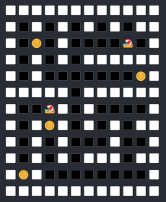
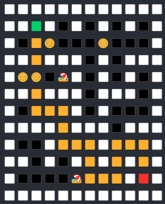

# Консольное приложение для генерации и решения лабиринтов

Это консольное приложение на Java позволяет генерировать лабиринты с использованием различных алгоритмов (алгоритм Прима, алгоритм Крускала и модифицированный алгоритм Крускала, который допускает циклы) и решать их с помощью алгоритмов поиска в ширину (BFS) или алгоритма Дейкстры. Пользователь может выбрать как алгоритм генерации, так и алгоритм решения через консольный интерфейс.

## Структура проекта
Проект разделен на несколько пакетов, каждый из которых содержит классы, отвечающие за определенные функции:
- **app** — Основные классы для запуска приложения.
- **cell** — Классы, описывающие элементы лабиринта.
- **converters** — Классы для преобразования лабиринта в различные представления.
- **generator** — Классы для генерации лабиринтов.
- **graph** — Классы, представляющие графовую структуру.
- **input** — Классы для получения ввода от пользователя.
- **models** — Модели данных, необходимые для работы приложения.
- **solver** — Классы для решения лабиринта.
- **visualization** - Классы для визуализации лабиринта

## Особенности

- **Генерация лабиринта**: Возможность выбора между алгоритмами Прима, Крускала и модифицированным Крускалом. Модифицированный алгоритм Крускала допускает наличие циклов в графе, создавая более запутанные лабиринты.
- **Решение лабиринта**: Два варианта алгоритма поиска пути — BFS (поиск в ширину) и алгоритм Дейкстры.
- **Пользовательский интерфейс**: Пользователь вводит параметры для генерации и решения лабиринта через консольный интерфейс.

## Описание классов и их назначение

### Пакет `app`
- **App**: Главный класс приложения, отвечающий за запуск и координацию работы всех компонентов.
- **GridGenerator**: Генератор сетки лабиринта.
- **MazeService**: Сервис для управления генерацией и решением лабиринта.
- **Settings**: Класс для получения настроек приложения. Позволяет получать параметры, такие как:
    - Высота и ширина лабиринта.
    - Алгоритм генерации лабиринта.
    - Алгоритм решения лабиринта.
    - Начальная и конечная координаты пути.
    - Количество монет и песка в лабиринте.

### Пакет `cell`
- **Cell**: Базовый класс для ячеек лабиринта.
- **CellType**: Перечисление для обозначения типа ячейки (стена, проход).
- **Passage**: Класс, представляющий проход в лабиринте.
- **PassageType**: Перечисление для обозначения типа прохода(обычный, песок, монета).
- **Wall**: Класс, представляющий стену в лабиринте.

### Пакет `converters`
- **ToGraphConverter**: Конвертер для преобразования лабиринта в граф.
- **ToMazeListConverter**: Конвертер для преобразования графа обратно в двумерный список.

### Пакет `generator`
- **Generator**: Интерфейс для генерации лабиринтов.
- **KruskalMazeGenerator**: Реализация алгоритма Крускала для генерации лабиринта.
- **ModifiedKruskalMazeGenerator**: Модифицированная версия алгоритма Крускала, которая позволяет создавать циклы в лабиринте.
- **PrimaMazeGenerator**: Реализация алгоритма Прима для генерации лабиринта.

### Пакет `graph`
- **Edge**: Класс, представляющий ребро графа.
- **Graph**: Класс для представления графа.
- **Vertex**: Класс, представляющий вершину графа.

### Пакет `input`
- **ConsoleInputProvider**: Класс для обработки ввода пользователя через консоль.
- **InputProvider**: Интерфейс для предоставления ввода.

### Пакет `models`
- **ConvertedMazeModel**: Модель для представления преобразованного лабиринта.
- **Coordinate**: Класс для хранения координат ячеек.
- **Direction**: Перечисление для направления движения в лабиринте.
- **Maze**: Основная модель лабиринта.

### Пакет `solver`
- **Solver**: Интерфейс для алгоритмов решения лабиринта.
- **BfsSolver**: Реализация алгоритма поиска в ширину (BFS), который находит кратчайший путь в лабиринте.
- **DijkstraSolver**: Реализация алгоритма Дейкстры, который находит кратчайший путь в лабиринте с учетом веса.

### Пакет `visualization`
- **Renderer**: Интерфейс для визуализации лабиринта.
- **ConsoleRenderer**: Реализация интерфейса `Renderer`, выводящая лабиринт и решение в текстовом виде в консоль.

## Пример работы
После запуска приложения вы увидите запросы на ввод параметров для генерации и решения лабиринта. Введите необходимые данные, и программа создаст лабиринт, а затем решит его.

### Инструкция по использованию

### 1. Ввод размеров лабиринта
После запуска программы вам будет предложено ввести **ширину** и **высоту** лабиринта.

Убедитесь, что значения ширины и высоты больше **0**.

### 2. Выбор алгоритма генерации лабиринта
Далее вам будет предложено выбрать один из доступных алгоритмов для генерации лабиринта. Введите номер алгоритма, который хотите использовать:
- **1** — Алгоритм Прима
- **2** — Алгоритм Крускала
- **3** — Модифицированный алгоритм Крускала (допускает наличие циклов в лабиринте)

### 3. Ввод количества монет и песка
Затем вам будет предложено ввести количество монет и количество песка, которые будут размещены в лабиринте. 

Убедитесь, что эти значения больше или равны **0**:

После ввода вышеперечисленных параметров программа сгенерирует и выдаст лабиринт

#### Пример лабиринта 10x10 с 4 монетами и 2 песками:

### 4. Выбор алгоритма решения лабиринта
После генерации лабиринта выберите алгоритм, который будет использоваться для поиска пути от начальной до конечной точки. Введите номер алгоритма:
- **1** — Алгоритм Дейкстры
- **2** — Алгоритм поиска в ширину (BFS)

### 5. Ввод начальной и конечной точки
Введите координаты начальной и конечной точки для поиска пути в лабиринте. Убедитесь, что координаты находятся в пределах лабиринта.

Формат ввода координат **x,y** (ширина, высота).

Отсчёт начинается с 0, поэтому верхний левый угол имеет координаты (0, 0), а нижний правый угол имеет координаты (ширина-1, высота-1).

После ввода всех параметов программа найдет путь от начальной до конечной точки и выведет его в консоль.

#### Пример найденного пути в лабиринте:

